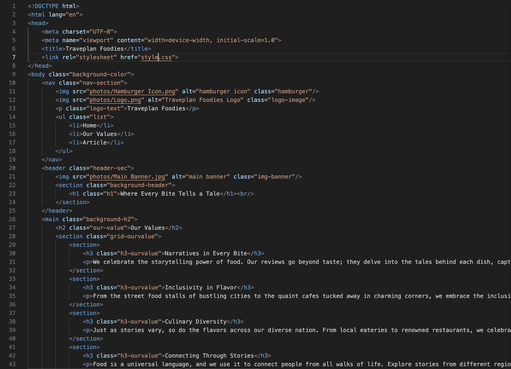
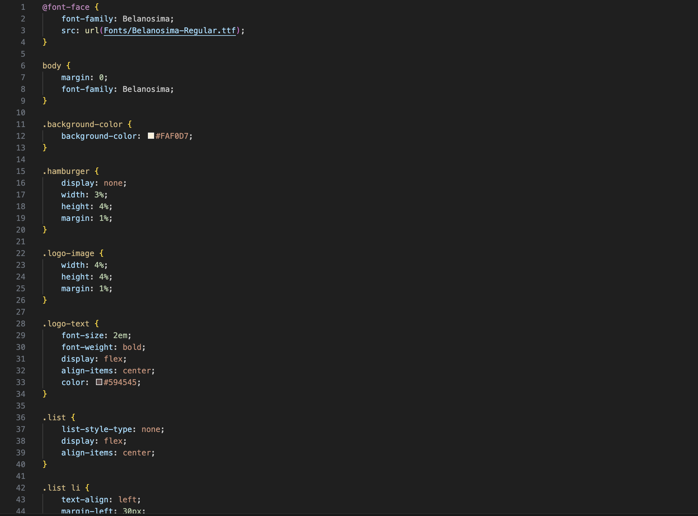

# Hello! Welcome to my Repository!
Hey there! Ready to dive into the behind-the-scenes adventure of how I turned a wild idea into a full-blown website? Grab a virtual seat, and let me spill the beans on the ups, downs, and everything in between as I journeyed from HTML and CSS tinkering to proudly hitting that 'Deploy' button!

## 1. Build the website using HTML  
 
In this HTML file, I've meticulously crafted the structure using semantic HTML tags, ensuring not just functionality but also enhanced clarity throughout the website creation process.

## 2. Beautify the website using CSS  
 
After establishing the foundation with the HTML structure, I transitioned to the CSS file. Here, my focus was on enhancing aesthetics and achieving harmony with the HTML elements. Utilizing the versatility of CSS grid, I organized a visually pleasing layout. Additionally, I delved into the intricacies of creating a responsive design by employing media queries, ensuring a seamless user experience across different devices.

## 3. Deploy the page  
 
After completing the HTML and CSS code and pushing them to my repository, I deployed the website using Netlify to make it visible on the internet. Initially, the CSS wasn't functioning properly on the deployed website, but after performing a hard reload, the CSS started working!

## 4. Set custom domain  
 
After successfully deploying the website, I configured a custom domain using the one I purchased last week. Since the configuration was completed last week, you can refer to my [Module 2 repository](https://github.com/revou-fsse-3/module-2-cathvale) to see how I set up the domain.

## 5.The website is ready!  
 
After successfully setting the custom domain, the website can now be accessed using the custom domain. Here is the final look of the website! You can visit my website by typing [ourtraveplan.site](https://ourtraveplan.site/)

## 6.Here is the look of Responsive website  
 
Here is how my website looks when we adjust the size, demonstrating that the responsive design, implemented using media queries, is working.